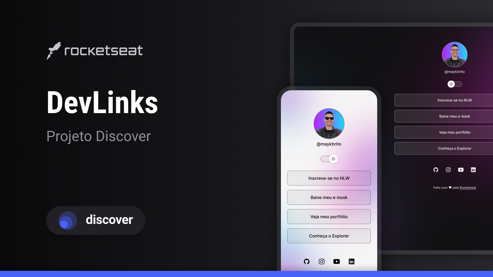

<h1 align="center"> Meu primeiro projeto </h1>

Progama exclusivo e gratuito, promovido pela Rocketseat para ensino de tecnologias WEB.

  <a href="#-tecnologias">Tecnologias</a>&nbsp;&nbsp;&nbsp;|&nbsp;&nbsp;&nbsp;
  <a href="#-projeto">Projeto</a>&nbsp;&nbsp;&nbsp;|&nbsp;&nbsp;&nbsp;
  <a href="#-layout">Layout</a>&nbsp;&nbsp;&nbsp;|&nbsp;&nbsp;&nbsp;
  <a href="#memo-licença">Licença</a>

  

 

  

## 🚀 Tecnologias

Esse projeto foi desenvolvido com as seguintes tecnologias:

- HTML e CSS
- JavaScript
- Git e Github
- Figma
## 💻 Projeto

O "Meu primeiro projeto" é um agregador de links para demonstar meu amor pela minha esposa e filha.

## 🔖 Layout

Você pode visualizar o layout do projeto através [DESSE LINK]
(https://www.figma.com/file/MF894TdzM99Fg9Ssu4KyMq/DevLinks-
(Copy)?node-id=1%3A113&t=8x94o7ecTaQMC2CS-1/duplicate). É
necessário ter conta no [Figma](kttps://figma.com) para acessá-lo.

## :memo: Licença 

Esse projeto esta sob a licença MIT.

---

Feito com amor by Rocketseat :wave: [Participe da nossa comunidade!]
(https://discord.g/rocketseat)